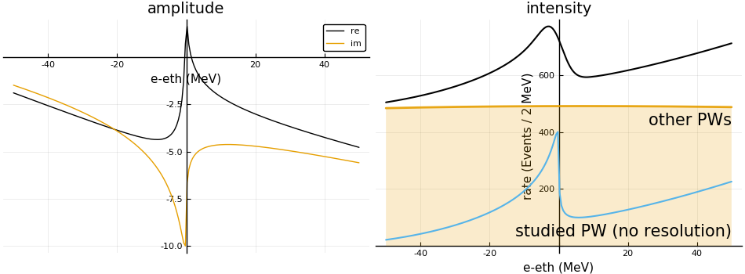
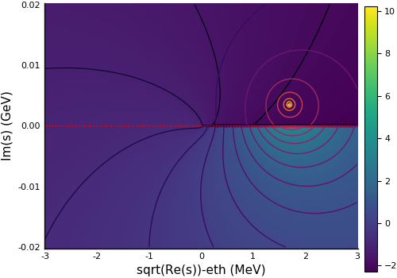

# Interpretation of Pc(4312) signal
Analysis of the LHCb data for the pentaquark candidate Pc(4312), [PRL2019](http://inspirehep.net/record/1730812).

The repository contains:
 - ArXiv [source](arxiv/) of the paper
 - `Julia` [code](julia/pentaquark_two_channels.jl) that reproduce the main result of the paper
 - Some additional [plots](plots/)

## Main model -- scattering length approximation (Case A)

1) A complex amplitude as a function of the energy of Jpsi and proton with respect to the Sigmac+D0 threshold.

2) A plot of the complex sheets in vicinity of the real axes where the data are present (red dotted line). Logarithm of the absolute value, log(|A|^2), of the amplitude squared is used to represent the complex plane. These value on the first and the second sheets are shown by the color code for positive and negative values of the y-axis respectively.
The contours for x>0, y>0 represent the fourth sheet with the Pc pole.
It likely corresponds to the virtual state as suggested in the papar.

